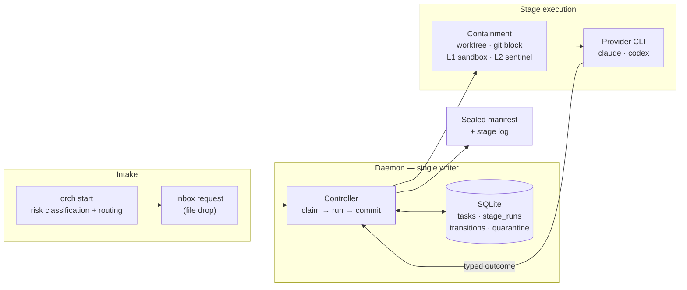
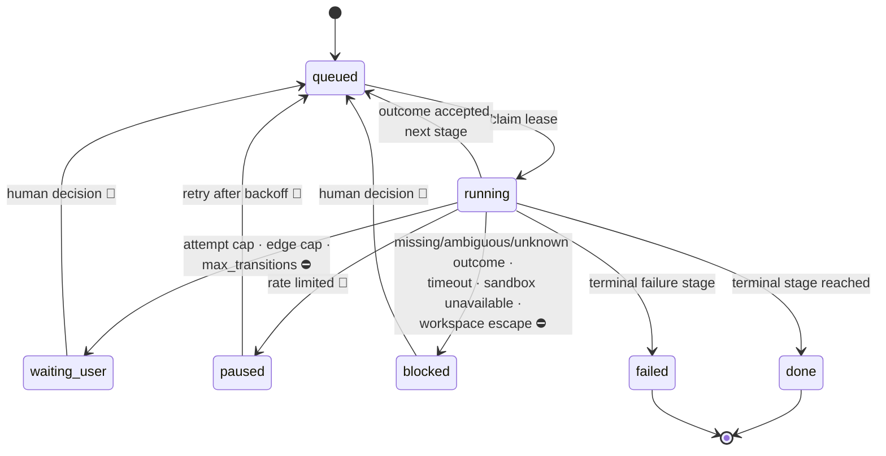

# agent-orch

A stateful dispatcher for agent tasks. SQLite-backed state machine, a
single-writer daemon, caps on every loop, cross-provider stop gates, and a
sealed evidence trail for every stage that ran.

Pure standard library. Nothing to install, no service to stand up.

```sh
python3 -m orchestrator.demo    # synthetic task, fake agent, no credentials needed
```

---

## Why a service and not a loop

A shell loop that calls an agent repeatedly works fine until something fails
halfway through. Then the questions start, and a loop cannot answer any of
them: which stage was running, how many attempts it already burned, whether
its output was ever reviewed, and whether resuming is safe or would repeat a
step whose side effects already landed.

Those answers have to live in durable state that exactly one writer owns. That
is what this is. Four properties follow, each there because of a specific way
agent loops fail:

**Typed outcomes, not output parsing.** A stage ends by printing exactly one
`ORCHESTRATOR_OUTCOME: <name>` line, and the profile maps outcome names to the
next stage. Two conflicting outcomes in one run is an `ambiguous_outcome` stop,
not a coin flip; an outcome the stage was never allowed to produce is an
`unknown_outcome` stop. The state machine never guesses what the agent meant.

**Caps on every loop.** Stages have attempt caps and every edge of the state
machine has a transition cap. Two agents that disagree — a reviewer that keeps
blocking, an implementer that keeps re-submitting — get a bounded number of
round trips and then stop for a human, instead of burning quota until someone
notices. The task's whole lifetime is bounded again by `max_transitions`.

**Reclaim, not orphan.** Stage runs are leased. If the daemon dies mid-stage,
startup reconciliation finds the run still marked `running`, blocks it with a
reason, and quarantines anything unaccounted for — rather than leaving a task
that looks alive forever, or silently re-running work that already had effects.

**Evidence, sealed.** Every stage run writes a log inside the task's artifact
directory, and on commit a manifest is sealed over it: log hash, output hash,
exit code, classification, outcome, model, duration, token usage, and the run
and lease tokens. Reconstructing what happened does not depend on anyone
having kept a terminal open.

## Architecture



Intake classifies a task and routes it to a profile; the request lands in an
inbox as a file. The daemon is the only process that writes state. For each
stage it claims a lease, runs the provider CLI inside containment, classifies
the result, and commits the transition and its sealed manifest together.

## Lifecycle



⛔ a cap or a guard stopped the machine · 👤 only a human decision moves it on,
and it waits indefinitely · 🔁 resumable without a decision.

`waiting_user` and `blocked` differ by cause, not severity. The first means a
bound was reached — the loop was working, it just ran out of rope. The second
means a run produced something the machine refuses to act on. Both need a
human; both keep every artifact.

## Stop gates

For work whose blast radius justifies it, the reviewer comes from a different
provider family than the executor. A model reviewing its own output shares its
own blind spots, so a same-family review mostly confirms what the executor
already believed.

- The gate profile is chosen by *who executed*: Codex work is reviewed by
  Claude, Claude work by Codex.
- Only `allow` reaches `done`. There is no path from a gate to terminal
  success without one.
- `block` is capped too. A gate cannot loop forever; at the cap the task stops
  for a human instead of spending more on re-reviews.
- The gate writes its review to a named path with a required schema, and it
  cannot apply its own verdict — recording the decision is a separate,
  human-driven step.

## Containment, honestly

Three layers, and the boundaries are the interesting part.

| Layer | Mechanism | Stops |
|---|---|---|
| Git | worktree; credentials stripped; `GIT_ASKPASS`/`GIT_SSH_COMMAND` → `/usr/bin/false`; unconditional `pre-push` reject | results leaving through git |
| L1 prevention | `sandbox-exec` write allowlist: workspace, artifact dir, temp dirs, provider CLI state dirs | writes outside the workspace |
| L2 detection | sentinel snapshot of declared protected roots, before and after each stage | writes that happened anyway |
| L3 isolation | **not implemented** | a stage reading whatever the user can read, or sending it anywhere |

L1 fails closed: on a host without `sandbox-exec`, a mutating stage refuses to
run unless `--allow-unsandboxed` is passed. L2 is deliberately independent of
L1 — `sandbox-exec` is deprecated by Apple, and a detection layer that only
works when prevention works is decoration. When L2 fires, the task is blocked
and quarantined with the offending paths recorded, *including when the stage
reported success*, which is the case that actually matters.

Commits inside containment use a synthetic identity by default; using a real
one is explicit and per-run ([ADR 0001](docs/decisions/0001-git-identity.md)).

What is still open is written down rather than left to be discovered:
[`docs/threat-model.md`](docs/threat-model.md).

## Quickstart

```sh
python3 -m orchestrator.demo                        # synthetic end-to-end run
python3 -m unittest discover -s orchestrator/tests  # engine suite
python3 -m unittest discover -s tools/tests         # sanitization scanner suite
```

The demo needs no credentials and makes no network calls. It runs a synthetic
task against a fake agent that disagrees with itself on purpose, so the review
edge reaches its cap. Abridged output:

```
status waiting_user | stop_reason edge_cap | stage draft | transitions 4 / 10

edges:  draft.submit  2/4
        review.allow  0/1
        review.block  1/1      <- cap reached

runs:   draft  attempt 1 -> submit  committed  sealed
        review attempt 1 -> block   committed  sealed
        draft  attempt 1 -> submit  committed  sealed
        review attempt 1 -> block   committed  sealed

notifications: edge_cap
```

That is the intended behaviour, not a failure: two agents disagreed, the loop
was bounded, every run was sealed, and the task is parked for a human with the
history intact.

## Profiles

A profile is a stage machine: owner, attempt cap, timeout, prompt, and the map
from typed outcomes to next stages, plus per-edge caps.

| Profile | Shape |
|---|---|
| `propose.yaml` | draft → review, review can send it back |
| `spec_review.yaml` | two reviewers from different provider families |
| `claude_apply_codex_review.yaml` | apply → review → repair → delta review |
| `codex_implement_claude_review.yaml` | the same, executor and reviewer swapped |
| `stop_gate_claude.yaml` / `stop_gate_codex.yaml` | one gate stage, `allow` or `block` |
| `provider_smoke.yaml` / `provider_smoke_gated.yaml` | minimal end-to-end provider check |
| `artifact_validation.yaml` | validate → review → revise harness |

The file names encode which provider plays which role — convenient when the
pairing matters, irrelevant otherwise. Nothing in the engine depends on the
names; a deployment is expected to write its own.

Intake's risk vocabulary works the same way: generic defaults ship here, and a
deployment supplies its own keywords through `ORCH_RISK_RULES`. A malformed
rules file refuses to load rather than silently classifying everything as low
risk. See [`risk-rules.yaml`](risk-rules.yaml) for the format.

## Layout

```
orchestrator/            engine: controller, daemon, db, ipc, profile, runner, containment, start, cli
orchestrator/profiles/   stage machines
orchestrator/examples/   fake agent and the demo profile
orchestrator/tests/      engine suite, including the containment acceptance tests
tools/                   sanitization scanner and the pre-commit hook wrapping it
packaging/               service templates (placeholders, not machine paths)
docs/                    threat model, decisions, extraction inventory
```

## Provenance

This was extracted from a private system it was built for and ran in.
[`docs/extraction-inventory.md`](docs/extraction-inventory.md) records every
file as taken, rewritten, or left behind, and why — including what is
deliberately not here.

## License

All rights reserved. **Source-available for reference and portfolio evaluation
only** — see [LICENSE](LICENSE). Reading it, and running the bundled demo
locally to see how it behaves, is welcome. Use in any product, service, or
internal tool, redistribution, derivative works, and use as training data are
not permitted without written permission. This is not open source; no OSI
license is granted or implied.
