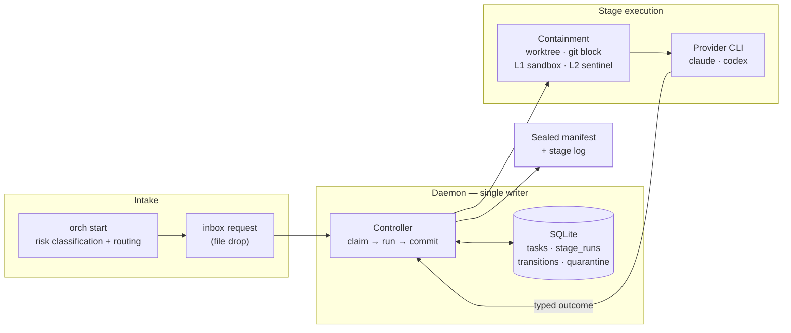
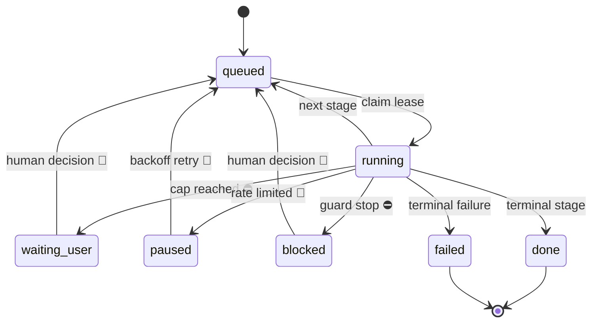

# agent-orch

[](https://github.com/Roger-Sung/agent-orch/actions/workflows/ci.yml)

繁體中文摘要 → [README.zh-TW.md](README.zh-TW.md)

A stateful dispatcher for agent tasks. SQLite-backed state machine, a
single-writer daemon, caps on every loop, cross-provider stop gates, and a
sealed evidence trail for every stage that ran.

Built to run long-lived Claude/Codex workflows unattended, where retries and
side effects must be auditable afterwards. Published to be read, not adopted —
see [Project status](#project-status). The engine has no third-party Python
dependencies, and the demo needs no setup.

---

## Why a service and not a loop

A shell loop that calls an agent repeatedly works fine until something fails
halfway through. Then the questions start, and a loop cannot answer any of
them: which stage was running, how many attempts it already burned, whether
its output was ever reviewed, and whether resuming is safe or would repeat a
step whose side effects already landed.

Those answers have to live in durable state that exactly one writer owns. That
is what this is. Four properties follow, each there because of a specific way
agent loops fail:

**Typed outcomes, not output parsing.** A stage ends by printing exactly one
`ORCHESTRATOR_OUTCOME: <name>` line, and the profile maps outcome names to the
next stage. Two conflicting outcomes in one run is an `ambiguous_outcome` stop,
not a coin flip; an outcome the stage was never allowed to produce is an
`unknown_outcome` stop. The state machine never guesses what the agent meant.

**Caps on every loop.** Stages have attempt caps and every edge of the state
machine has a transition cap. Two agents that disagree — a reviewer that keeps
blocking, an implementer that keeps re-submitting — get a bounded number of
round trips and then stop for a human, instead of burning quota until someone
notices. The task's whole lifetime is bounded again by `max_transitions`.

**Reclaim, not orphan.** Stage runs are leased. If the daemon dies mid-stage,
startup reconciliation finds the run still marked `running`, blocks it with a
reason, and quarantines anything unaccounted for — rather than leaving a task
that looks alive forever, or silently re-running work that already had effects.

**Evidence, sealed.** Every stage run writes a log inside the task's artifact
directory, and on commit a manifest is sealed over it: log hash, output hash,
exit code, classification, outcome, model, duration, token usage, and the run
and lease tokens. Reconstructing what happened does not depend on anyone
having kept a terminal open.

## How it came to be

This began as a way to stop babysitting an agent through a spec-to-code
pipeline: start it, walk away, come back to a result that can be verified. Each
mechanism was added when that promise broke in a specific way. A run that could
not be resumed safely became durable state with a single writer. A same-family
review that confirmed the executor's assumptions instead of testing them became
the cross-provider gate. A stage that ignored its workspace and rewrote a live
data store elsewhere — reporting success, caught by a human reading the result —
became L1 prevention and L2 detection. The shape is the record of what broke.

## 30-second demo — no credentials, no network

```sh
python3 -m orchestrator.demo                        # synthetic end-to-end run
python3 -m unittest discover -s orchestrator/tests  # engine suite
python3 -m unittest discover -s tools/tests         # sanitization scanner suite
```

The demo runs a synthetic task against a fake agent that disagrees with itself
on purpose, so the review edge reaches its cap. No provider CLI is called and
nothing leaves the machine. Abridged output:

```
status waiting_user | stop_reason edge_cap | stage draft | transitions 4 / 10

edges:  draft.submit  2/4
        review.allow  0/1
        review.block  1/1      <- cap reached

runs:   draft  attempt 1 -> submit  committed  sealed
        review attempt 1 -> block   committed  sealed
        draft  attempt 1 -> submit  committed  sealed
        review attempt 1 -> block   committed  sealed

notifications: edge_cap
```

That is the intended behaviour, not a failure: two agents disagreed, the loop
was bounded, every run was sealed, and the task is parked for a human with the
history intact.

Running it for real needs two authenticated provider CLIs and a handful of
environment variables; that is the operator's manual,
[`docs/operating.md`](docs/operating.md).

## Architecture



Intake classifies a task and routes it to a profile; the request lands in an
inbox as a file. The daemon is the only process that writes state. For each
stage it claims a lease, runs the provider CLI inside containment, classifies
the result, and commits the transition and its sealed manifest together.

agent-orch does not host models and does not call model APIs. It spawns the
locally installed, authenticated Claude Code and Codex CLIs — the same process
you would run by hand — so accounts, billing and model choice stay with the
CLIs, and no API key is held here.

## Lifecycle



Three kinds of stop. A **cap** (`attempt_cap`, `edge_cap`, `transition_cap`)
parks the task as `waiting_user`: the loop was working, it ran out of rope. A
**refusal** (`missing_outcome`, `ambiguous_outcome`, `unknown_outcome`,
`timeout`, sandbox or containment failures) parks it as `blocked`: a run
produced something the machine will not act on. A **rate limit** pauses and
retries on its own. Only a human decision moves a parked task, it waits
indefinitely, and every artifact is kept. `protected_root_drift` is the one
stop that additionally requires an independent containment review before a
rerun can be authorised. The full stop-reason table is in
[`docs/operating.md`](docs/operating.md#stop-reasons).

## Stop gates

For work whose blast radius justifies it, the reviewer comes from a different
provider family than the executor. A model reviewing its own output shares its
own blind spots, so a same-family review mostly confirms what the executor
already believed.

- The gate profile is selected from who executed, not configured per task, so
  the reviewer is always the *other* owner slot — no model clears its own
  output.
- Which provider plays which role is a default, not the mechanism. Out of the
  box Claude implements and Codex reviews and gates; swapping the profiles
  reverses it without touching the engine.
- Only `allow` reaches `done`. There is no path from a gate to terminal
  success without one.
- `block` is capped too. A gate cannot loop forever; at the cap the task stops
  for a human instead of spending more on re-reviews.
- The gate writes its review to a named path with a required schema, and it
  cannot apply its own verdict — recording the decision is a separate,
  human-driven step.

One honest caveat: "cross-provider" means two CLIs from *different provider
families*, and the engine trusts that the `claude` and `codex` slots really are
that. It does not verify the commands behind them; an operator who points both
at one family keeps the machinery and loses the property. Enforcement is
planned, not implemented.

## Containment, honestly

Three layers, plus a git egress guard — and the boundaries are the interesting
part. A mutating stage works inside a git worktree of the target repository and
commits its changes: git is both the working medium and an escape channel,
which is why it gets a row of its own before the layers proper.

| Layer | Mechanism | Stops |
|---|---|---|
| Git | worktree; credentials stripped; `GIT_ASKPASS`/`GIT_SSH_COMMAND` → `/usr/bin/false`; unconditional `pre-push` reject | results leaving through git |
| L1 prevention | `sandbox-exec` write allowlist: workspace, artifact dir, temp dirs, provider CLI state dirs | writes outside the workspace |
| L2 detection | sentinel snapshot of declared protected roots, before and after each stage | writes that happened anyway |
| L3 isolation | **not implemented** | a stage reading whatever the user can read, or sending it anywhere |

L1 fails closed: on a host without `sandbox-exec`, a mutating stage refuses to
run unless `--allow-unsandboxed` is passed. L2 is deliberately independent of
L1 — `sandbox-exec` is deprecated by Apple, and a detection layer that only
works when prevention works is decoration. When L2 fires, the task is blocked
and quarantined with the offending paths recorded, *including when the stage
reported success*, which is the case that actually matters.

L1 and L2 exist because of the incident in [How it came to be](#how-it-came-to-be):
a stage that wrote outside its workspace and reported success. Their behaviour
is proven by the containment acceptance tests in the engine suite, not by that
incident — the layers did not exist yet when it happened. What each layer does
and does not cover, and what is still open, is written down in
[`docs/threat-model.md`](docs/threat-model.md).

## Profiles

A profile is a stage machine: owner, attempt cap, timeout, prompt, and the map
from typed outcomes to next stages, plus per-edge caps.

| Profile | Shape |
|---|---|
| `propose.yaml` | draft → review, review can send it back |
| `spec_review.yaml` | two reviewers from different provider families |
| `claude_apply_codex_review.yaml` | apply → review → repair → delta review (**the default apply pairing**) |
| `codex_implement_claude_review.yaml` | the same, executor and reviewer swapped |
| `stop_gate_claude.yaml` / `stop_gate_codex.yaml` | one gate stage, `allow` or `block` |
| `provider_smoke.yaml` / `provider_smoke_gated.yaml` | minimal end-to-end provider check |
| `artifact_validation.yaml` | validate → review → revise harness |

The filenames are descriptive only, but the owner IDs inside them (`claude`,
`codex`) are part of the current implementation — the engine accepts exactly
those two. A deployment is expected to write its own profiles. Review is a
short-output, high-leverage position: a reviewer that finds one more real
problem is worth more there than at the keyboard. Codex holds the default
review seat; swapping the profiles reverses the pairing.

## Evidence

- 342 engine tests and 13 sanitization-scanner tests, run on Linux and macOS
  by CI. The engine suite includes the containment acceptance tests; the L1
  tests that need macOS `sandbox-exec` skip on hosts without it.
- Every committed stage run leaves a sealed manifest — a run cut off by a
  daemon crash is blocked with its log appended, not sealed. `python3 -m
  orchestrator containment-inspect TASK_ID` re-verifies retained evidence over
  a read-only connection.
- CI runs only a partial sanitization scan, because the strict rules need
  site-local literals that never reach the repository. A green badge means the
  tests passed and the repository-side rules found nothing — the strict scan is
  an operator step described in `docs/operating.md`.

## What is and is not here

Implemented: the state machine, single-writer daemon, typed outcomes, caps,
lease reclaim, sealed manifests, cross-provider gates, git egress guard, L1
prevention (macOS), L2 detection, the fake-agent demo, and the sanitization
scanner with its fail-closed pre-commit hook.

Not implemented, and said so in the code rather than left to be discovered: L3
isolation; enforced cross-family reviewer selection; a generic CLI adapter so
other agent CLIs can be owners; provider capability discovery; Windows support.

## Layout

```
orchestrator/            engine: controller, daemon, db, ipc, profile, runner, containment, start, cli, config, doctor
orchestrator/profiles/   stage machines
orchestrator/examples/   fake agent and the demo profile
orchestrator/tests/      engine suite, including the containment acceptance tests
tools/                   sanitization scanner and the pre-commit hook wrapping it
packaging/               service templates (placeholders, not machine paths)
docs/                    operator's manual, threat model, decisions, extraction inventory
SECURITY.md              scope, reporting, and what this is not
```

## Provenance

This was extracted from a private system it was built for and ran in.
[`docs/extraction-inventory.md`](docs/extraction-inventory.md) records every
file as taken, rewritten, or left behind, and why — including what is
deliberately not here.

## Project status

A portfolio and reference release. It is published to be read, not adopted:

- Not a package. There is no release on any index, no versioning promise, and
  no stable API.
- Not a supported product. Issues and pull requests are not being accepted, and
  no maintenance is promised.
- Built for one deployment. It runs in the private system it was extracted
  from; anything else is unsupported by construction.
- **Not a sandbox for untrusted code.** The containment layers stop a capable
  but non-malicious agent from acting outside its scope; they are not an
  adversarial boundary. See [SECURITY.md](SECURITY.md) for the reporting
  process and the scope, and [`docs/threat-model.md`](docs/threat-model.md) for
  what each layer does and does not cover.

## License

All rights reserved. **Source-available for reference and portfolio evaluation
only** — see [LICENSE](LICENSE). Reading it, and running the bundled demo
locally to see how it behaves, is welcome. Use in any product, service, or
internal tool, redistribution, derivative works, and use as training data are
not permitted without written permission, except for rights that GitHub's terms
necessarily grant to GitHub and its users while the repository is hosted there
(including GitHub's fork feature). This is not open source; no OSI license is
granted or implied.
