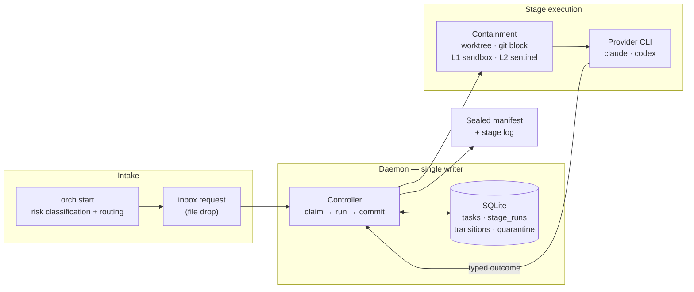
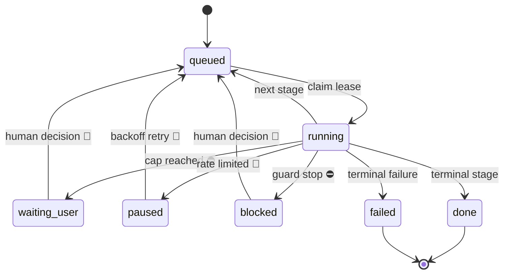

# agent-orch

[](https://github.com/Roger-Sung/agent-orch/actions/workflows/ci.yml)

A stateful dispatcher for agent tasks. SQLite-backed state machine, a
single-writer daemon, caps on every loop, cross-provider stop gates, and a
sealed evidence trail for every stage that ran.

Built for operators running long-lived Claude/Codex workflows where retries and
side effects must be auditable.

The engine has no third-party Python dependencies, and the demo needs no setup.
Production use runs a daemon and provider CLIs.

---

## Why a service and not a loop

A shell loop that calls an agent repeatedly works fine until something fails
halfway through. Then the questions start, and a loop cannot answer any of
them: which stage was running, how many attempts it already burned, whether
its output was ever reviewed, and whether resuming is safe or would repeat a
step whose side effects already landed.

Those answers have to live in durable state that exactly one writer owns. That
is what this is. Four properties follow, each there because of a specific way
agent loops fail:

**Typed outcomes, not output parsing.** A stage ends by printing exactly one
`ORCHESTRATOR_OUTCOME: <name>` line, and the profile maps outcome names to the
next stage. Two conflicting outcomes in one run is an `ambiguous_outcome` stop,
not a coin flip; an outcome the stage was never allowed to produce is an
`unknown_outcome` stop. The state machine never guesses what the agent meant.

**Caps on every loop.** Stages have attempt caps and every edge of the state
machine has a transition cap. Two agents that disagree — a reviewer that keeps
blocking, an implementer that keeps re-submitting — get a bounded number of
round trips and then stop for a human, instead of burning quota until someone
notices. The task's whole lifetime is bounded again by `max_transitions`.

**Reclaim, not orphan.** Stage runs are leased. If the daemon dies mid-stage,
startup reconciliation finds the run still marked `running`, blocks it with a
reason, and quarantines anything unaccounted for — rather than leaving a task
that looks alive forever, or silently re-running work that already had effects.

**Evidence, sealed.** Every stage run writes a log inside the task's artifact
directory, and on commit a manifest is sealed over it: log hash, output hash,
exit code, classification, outcome, model, duration, token usage, and the run
and lease tokens. Reconstructing what happened does not depend on anyone
having kept a terminal open.

## Quickstart

### 30-second demo — no credentials, no network

```sh
python3 -m orchestrator.demo                        # synthetic end-to-end run
python3 -m unittest discover -s orchestrator/tests  # engine suite
python3 -m unittest discover -s tools/tests         # sanitization scanner suite
```

The demo runs a synthetic task against a fake agent that disagrees with itself
on purpose, so the review edge reaches its cap. No provider CLI is called and
nothing leaves the machine. Abridged output:

```
status waiting_user | stop_reason edge_cap | stage draft | transitions 4 / 10

edges:  draft.submit  2/4
        review.allow  0/1
        review.block  1/1      <- cap reached

runs:   draft  attempt 1 -> submit  committed  sealed
        review attempt 1 -> block   committed  sealed
        draft  attempt 1 -> submit  committed  sealed
        review attempt 1 -> block   committed  sealed

notifications: edge_cap
```

That is the intended behaviour, not a failure: two agents disagreed, the loop
was bounded, every run was sealed, and the task is parked for a human with the
history intact.

### Real Claude + Codex setup

**Requirements**

- **Python 3.11 or newer.** The engine imports `tomllib`; there are no
  third-party dependencies. CI exercises 3.12 on Linux and macOS.
- **Both provider CLIs installed and already authenticated.** `claude` and
  `codex` must be on the `PATH` *of the daemon process*, which is usually not
  the same PATH as your shell — a service manager starts with a minimal one, so
  the bundled launcher sets it explicitly. Log in with each CLI first: the
  daemon runs unattended and cannot complete an interactive sign-in, and a
  stage whose CLI is unauthenticated fails as a provider error.
- **macOS or Linux.** Windows is not supported — the IPC layer uses `fcntl`
  file locks. L1 is macOS-only on top of that: the write sandbox uses
  `sandbox-exec`, and on other platforms a mutating stage refuses to run
  unless `--allow-unsandboxed` is passed; L2 detection and the overlap guard
  work on both supported systems.

**Configure and start**

```sh
export ORCH_HOME=~/.local/state/agent-orch     # where state and evidence live
export ORCH_ALLOW_UNATTENDED=1                 # see below before setting this
export ORCH_CLAUDE_MODEL=claude-opus-5         # required, no default
export ORCH_CODEX_MODEL=gpt-5.5                # required, no default
export ORCH_PROTECTED_ROOTS="$HOME/important-repo"   # L2 watches these
./packaging/run-daemon.sh
```

`ORCH_ALLOW_UNATTENDED=1` is a deliberate acknowledgement, enforced twice with
different precision. The bundled launcher requires it **unconditionally**,
because it composes commands that disable the approval prompts. The daemon
independently scans the configured commands for **known approval-disabling
flags** (`--dangerously-skip-permissions`, `--approve-for-me`) and requires the
same acknowledgement when it detects one — so a deployment with its own
launcher still hits the gate, but only if a known flag is spelled out: a
wrapper script, a renamed flag, or a CLI config file that disables approvals
another way is invisible to it. A clean scan means "no known flag was spelled
out here", not "this deployment is attended". The launcher gate stays the
first line because it does not depend on recognising anything. The provider CLIs are invoked with their approval
prompts disabled — that is what makes unattended operation possible — so a
stage acts with the full authority of the daemon's UNIX user: it can read
anything that account can read, and nothing isolates it at the process level.
Run it as an account whose reach you are comfortable handing to an agent, and
read the [threat model](docs/threat-model.md) first.

**One place for the variables, instead of eight exports**

The variables above can live in a config instead of a shell history, and the
worst intake trap — a CLI and a daemon silently resolving different
`ORCH_HOME`s — has two purpose-built answers:

- `~/.config/agent-orch/orch.toml` (or `ORCH_CONFIG`): a flat TOML table of
  `ORCH_*` keys the CLI loads at startup. Variables already set in the
  environment always win, and the two acknowledgement gates
  (`ORCH_ALLOW_UNATTENDED`, `ORCH_ALLOW_UNSANDBOXED`) are refused in the file
  on purpose — they record a decision, and decisions do not belong in a file
  nobody re-reads.
- `packaging/orch`, a PATH shim that sources the *same* env file as
  `run-daemon.sh` (`~/.config/agent-orch/env.sh`, template in
  `packaging/env.sh.template`) before invoking the CLI — so the CLI and the
  daemon cannot each pick their own state directory.

```toml
# ~/.config/agent-orch/orch.toml
ORCH_HOME = "~/.local/state/agent-orch"
ORCH_PROTECTED_ROOTS = ["~/important-repo"]        # lists join with the path separator
ORCH_CLAUDE_COMMAND = "claude -p --model claude-opus-5"
```

**Check the wiring before a task discovers it**

```sh
python3 -m orchestrator doctor
```

Read-only. Reports whether `ORCH_HOME` is set or silently defaulted, whether
both provider CLIs resolve and answer from *this* environment, whether L1 is
available, whether L2 is actually on (`ORCH_PROTECTED_ROOTS` empty means it is
OFF), and whether a declared write root contradicts a protected root. Exit
code 1 when anything would make a stage refuse, so it can gate a provisioning
script.

**Smoke test it end to end**

```sh
python3 -m orchestrator enqueue \
    --type provider-smoke \
    --profile orchestrator/profiles/provider_smoke.yaml \
    --input /path/to/one-line-brief.md

python3 -m orchestrator status <task_id>       # expect: done
```

The smoke profile runs one stage per provider with a trivial prompt, which is
the cheapest way to confirm that both CLIs, the model pins, and the daemon are
actually wired together.

**Verification note.** CI runs both suites on both platforms plus a **partial**
sanitization scan — partial because the scanner's site-local rules need literals
(an operator's name, a home directory, an employer domain) that deliberately
never reach this repository or a CI runner. So a green badge means the tests
passed and the repository-side rules found nothing, and nothing more.

The strict scan is an operator requirement rather than something CI can attest:
whoever publishes a change is expected to run `tools/sanitize-lint.py` with a
local secrets file (the pre-commit hook refuses to run without one) and to scan
the history commit by commit before pushing. An outside reader cannot verify
that a process was followed, only that the tool exists and that the tests pass.

## Providers

agent-orch does not host models and does not call model APIs. It orchestrates
locally installed, authenticated agent CLIs — the process it spawns for a stage
is the same CLI you would run by hand. Two are supported today: **Claude Code
CLI** and **Codex CLI**. Both must be installed and authenticated before the
daemon starts; authentication, accounts, and model costs stay with your own
CLIs, and no API key is held here. Note that the bundled launcher deliberately
clears the Anthropic API overrides (`ANTHROPIC_BASE_URL`, `ANTHROPIC_API_KEY`)
so the Claude CLI cannot silently inherit pay-per-token billing or a custom
endpoint from the parent environment. That is the extent of it: the Codex
CLI's own endpoint and billing configuration live in its config files, which
the launcher does not police. A deployment that authenticates by API key on
purpose edits its own copy of the launcher.

The engine reads one variable per owner, `ORCH_CLAUDE_COMMAND` and
`ORCH_CODEX_COMMAND`, and runs exactly what they contain. Model selection is
therefore whatever flag the CLI takes — the orchestrator has no model registry,
it only records the model it can read back from the command it ran.

```sh
# Using the bundled launcher, which composes the commands for you:
export ORCH_CLAUDE_MODEL=claude-opus-5
export ORCH_CODEX_MODEL=gpt-5.5
./packaging/run-daemon.sh

# Or drive the daemon directly, in which case the full command is yours to
# set — including the non-interactive flags the launcher would have added, and
# the acknowledgement the daemon demands once it sees them:
export ORCH_CLAUDE_COMMAND='claude -p --dangerously-skip-permissions --model claude-opus-5'
export ORCH_CODEX_COMMAND='codex exec --approve-for-me --model gpt-5.5'
export ORCH_ALLOW_UNATTENDED=1
python3 -m orchestrator daemon
```

`ORCH_*_MODEL` is a convenience of the launcher, not something the engine
consults; if you set the command variables yourself, the model belongs inside
them.

**What "cross-provider" requires.** Two executable CLIs from *different provider
families* — not two model names from one vendor. The stop gate's claim is that a
reviewer does not share the executor's blind spots, and two models from one
family largely do. Pointing both owners at the same family leaves the machinery
working and the safety argument gone.

### Planned, not implemented

- A generic CLI adapter contract, so any agent CLI can be an owner. The wrapper
  requirements are already implied by the runner: non-interactive, prompt passed
  as an argument, and exactly one valid `ORCHESTRATOR_OUTCOME` line on stdout.
- Additional provider families.
- Provider capability discovery, instead of today's fixed `claude` / `codex`
  owner names.
- Enforced cross-family reviewer selection, so a same-family pairing is refused
  rather than merely discouraged.

## Architecture



Intake classifies a task and routes it to a profile; the request lands in an
inbox as a file. The daemon is the only process that writes state. For each
stage it claims a lease, runs the provider CLI inside containment, classifies
the result, and commits the transition and its sealed manifest together.

## Lifecycle



⛔ a cap or a guard stopped the machine · 👤 only a human decision moves it on,
and it waits indefinitely · 🔁 resumable without a decision.

Which stop reason lands where, and who can move it on:

| Stop reason | State | Moved on by |
|---|---|---|
| `attempt_cap` | `waiting_user` | human 👤 |
| `edge_cap` | `waiting_user` | human 👤 |
| `max_transitions` | `waiting_user` | human 👤 |
| `rate_limited` | `paused` | automatic backoff 🔁 |
| `missing_outcome` | `blocked` | human 👤 |
| `ambiguous_outcome` | `blocked` | human 👤 |
| `unknown_outcome` | `blocked` | human 👤 |
| `timeout` | `blocked` | human 👤 |
| `sandbox_unavailable` | `blocked` | human 👤 |
| `sandbox_setup_failed` | `blocked` | human 👤 |
| `containment_config_conflict` | `blocked` | human 👤 |
| `runner_cannot_enforce_guard` | `blocked` | human 👤 |
| `workspace_escape` | `blocked` | human 👤 |

`waiting_user` and `blocked` differ by cause, not severity. The first means a
bound was reached — the loop was working, it just ran out of rope. The second
means a run produced something the machine refuses to act on. Both need a
human; both keep every artifact.

## Stop gates

For work whose blast radius justifies it, the reviewer comes from a different
provider family than the executor. A model reviewing its own output shares its
own blind spots, so a same-family review mostly confirms what the executor
already believed.

- The gate profile is selected from who executed, not configured per task, so
  the reviewer is always the *other* owner slot — no model clears its own
  output. One honest caveat: the engine trusts that the `claude` and `codex`
  slots really are different provider families. It does not verify the commands
  behind them, so an operator who points both at one family keeps the machinery
  and loses the property (enforcement is planned, not implemented).
- Which provider plays which role is a default, not the mechanism. Out of the
  box Claude implements and Codex reviews and gates; swapping the profiles
  reverses it without touching the engine.
- Only `allow` reaches `done`. There is no path from a gate to terminal
  success without one.
- `block` is capped too. A gate cannot loop forever; at the cap the task stops
  for a human instead of spending more on re-reviews.
- The gate writes its review to a named path with a required schema, and it
  cannot apply its own verdict — recording the decision is a separate,
  human-driven step.

## Containment, honestly

Three layers, plus a git egress guard — and the boundaries are the interesting
part.

A mutating stage works inside a git worktree of the target repository and
commits its changes: git is both the working medium and an escape channel,
which is why it gets a row of its own before the layers proper.

| Layer | Mechanism | Stops |
|---|---|---|
| Git | worktree; credentials stripped; `GIT_ASKPASS`/`GIT_SSH_COMMAND` → `/usr/bin/false`; unconditional `pre-push` reject | results leaving through git |
| L1 prevention | `sandbox-exec` write allowlist: workspace, artifact dir, temp dirs, provider CLI state dirs | writes outside the workspace |
| L2 detection | sentinel snapshot of declared protected roots, before and after each stage | writes that happened anyway |
| L3 isolation | **not implemented** | a stage reading whatever the user can read, or sending it anywhere |

L1 fails closed: on a host without `sandbox-exec`, a mutating stage refuses to
run unless `--allow-unsandboxed` is passed. L2 is deliberately independent of
L1 — `sandbox-exec` is deprecated by Apple, and a detection layer that only
works when prevention works is decoration. When L2 fires, the task is blocked
and quarantined with the offending paths recorded, *including when the stage
reported success*, which is the case that actually matters.

Commits inside containment use a synthetic identity by default; using a real
one is explicit and per-run ([ADR 0001](docs/decisions/0001-git-identity.md)).

Three environment variables shape the layers: `ORCH_PROTECTED_ROOTS` declares
what L2 watches (empty means detection is off), `ORCH_SENTINEL_EXCLUDES`
adds deployment-specific whole components or component-relative subtrees that
L2 ignores, and `ORCH_EXTRA_WRITE_ROOTS`
declares additional directories a stage may write to — a build cache, for
instance — instead of turning L1 off wholesale. A write root that overlaps a
protected root refuses the stage rather than quietly punching a hole in the
layer that watches it. `ORCH_HOME` must itself sit outside every protected
root: stage logs and reports are written under it, so a protected root
covering it would make L2 flag the engine's own bookkeeping — the daemon
refuses to start on that configuration, and `orch doctor` reports it.
Exclusions are separated by the platform path separator (`:` on macOS) and
each one reduces L2 coverage, so deployments should keep them as narrow as
possible.

What is still open is written down rather than left to be discovered:
[`docs/threat-model.md`](docs/threat-model.md).

## Profiles

A profile is a stage machine: owner, attempt cap, timeout, prompt, and the map
from typed outcomes to next stages, plus per-edge caps.

| Profile | Shape |
|---|---|
| `propose.yaml` | draft → review, review can send it back |
| `spec_review.yaml` | two reviewers from different provider families |
| `claude_apply_codex_review.yaml` | apply → review → repair → delta review (**the default apply pairing**) |
| `codex_implement_claude_review.yaml` | the same, executor and reviewer swapped |
| `stop_gate_claude.yaml` / `stop_gate_codex.yaml` | one gate stage, `allow` or `block` |
| `provider_smoke.yaml` / `provider_smoke_gated.yaml` | minimal end-to-end provider check |
| `artifact_validation.yaml` | validate → review → revise harness |

The file names encode which provider plays which role — convenient when the
pairing matters, irrelevant otherwise. To be precise about what is fixed and
what is free: the *filenames* are descriptive only, but the owner IDs inside
them (`claude`, `codex`) are part of the current implementation — the engine
accepts exactly those two. A deployment is expected to write its own profiles.

Stage reports (the executor's report, the reviewer's verdict) are directed to
a `reports/` directory inside the task's artifact directory, not into the
workspace, so the workspace diff stays the actual change. Directed, not
enforced: the prompts name the path and the sandbox allows it, but the
workspace itself remains writable, so a stage that ignores the instruction can
still create files there — that shows up in review as diff noise, not as a
containment stop. One exception is stated in the prompt itself: a deployment
whose custom runner cannot accept the external path falls back to `reports/`
inside the workspace, and the prompt header says so.

For `apply` work the default is Claude implementing and Codex reviewing.
Review is a short-output, high-leverage position: a reviewer that finds one
more real problem is worth more there than at the keyboard, and in practice
Codex has been the stricter of the two. `orch start --executor codex` selects
the opposite pairing explicitly; the older keyword forms in the brief
(`executor=codex`, `codex implement`, `let codex`) still work as a fallback.

Intake's risk vocabulary works the same way: generic defaults ship here, and a
deployment supplies its own keywords through `ORCH_RISK_RULES`. A malformed
rules file refuses to load rather than silently classifying everything as low
risk. See [`risk-rules.yaml`](risk-rules.yaml) for the format.

## Layout

```
orchestrator/            engine: controller, daemon, db, ipc, profile, runner, containment, start, cli, config, doctor
orchestrator/profiles/   stage machines
orchestrator/examples/   fake agent and the demo profile
orchestrator/tests/      engine suite, including the containment acceptance tests
tools/                   sanitization scanner and the pre-commit hook wrapping it
packaging/               service templates (placeholders, not machine paths)
docs/                    threat model, decisions, extraction inventory
SECURITY.md              scope, reporting, and what this is not
```

## Provenance

This was extracted from a private system it was built for and ran in.
[`docs/extraction-inventory.md`](docs/extraction-inventory.md) records every
file as taken, rewritten, or left behind, and why — including what is
deliberately not here.

## Project status

A portfolio and reference release. It is published to be read, not adopted:

- Not a package. There is no release on any index, no versioning promise, and
  no stable API.
- Not a supported product. Issues and pull requests are not being accepted, and
  no maintenance is promised.
- Built for one deployment. It runs in the private system it was extracted
  from; anything else is unsupported by construction.
- **Not a sandbox for untrusted code.** The containment layers stop a capable
  but non-malicious agent from acting outside its scope; they are not an
  adversarial boundary. See [SECURITY.md](SECURITY.md) for the reporting
  process and the scope, and [`docs/threat-model.md`](docs/threat-model.md) for
  what each layer does and does not cover.

## License

All rights reserved. **Source-available for reference and portfolio evaluation
only** — see [LICENSE](LICENSE). Reading it, and running the bundled demo
locally to see how it behaves, is welcome. Use in any product, service, or
internal tool, redistribution, derivative works, and use as training data are
not permitted without written permission. This is not open source; no OSI
license is granted or implied.
