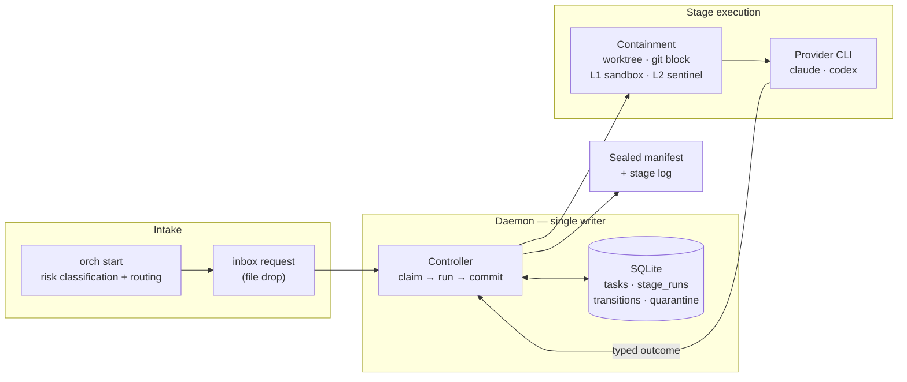
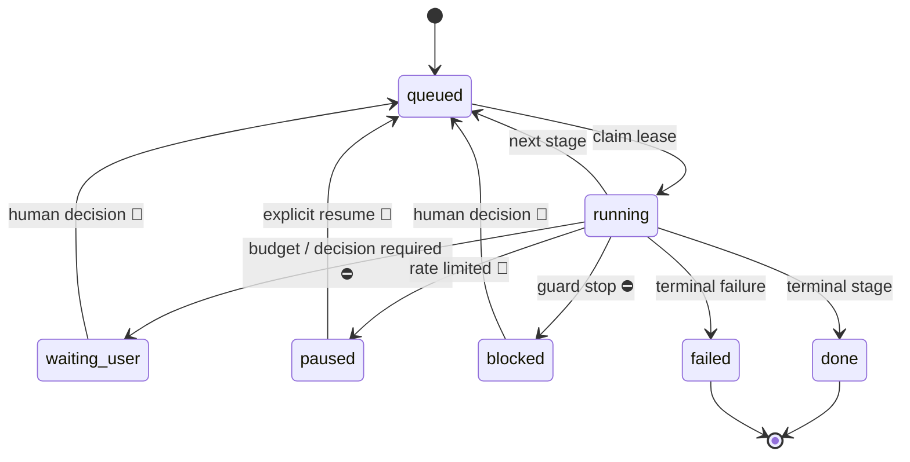

# agent-orch

[](https://github.com/Roger-Sung/agent-orch/actions/workflows/ci.yml)

繁體中文摘要 → [README.zh-TW.md](README.zh-TW.md)

Stateful AI agent orchestration for long-running Claude Code and Codex CLI
workflows. It runs unattended between explicit human-in-the-loop stop points.
Execution is governed by a SQLite-backed state machine, a single-writer
daemon, explicit convergence/stop policies, cross-provider review gates, and a sealed evidence
trail for every committed stage run.

Built for durable, resumable execution of long-lived Claude/Codex workflows,
where retries and side effects must be auditable afterwards. Published to be
read, not adopted — see [Project status](#project-status). The engine has no
third-party Python dependencies, and the demo needs no setup.

## For portfolio reviewers

This project is about **control-plane engineering around fallible agents**, not
training a model or claiming that two models always produce better code.
The interesting work is deciding which result is authoritative, who may advance
state, and what evidence makes a retry safe.

Start with the [offline demo](#30-second-demo--no-credentials-no-network), then
follow one of these paths from design to implementation and tests:

| Engineering question | Where to look |
|---|---|
| Can a crashed worker accidentally replay side effects? | [controller](orchestrator/controller.py), [daemon](orchestrator/daemon.py), [state-machine tests](orchestrator/tests/) |
| Can display text or an old PASS authorize the next stage? | [output boundary decision](docs/decisions/provider-output-boundary.md), [runner](orchestrator/runner.py), [output tests](orchestrator/tests/test_provider_output.py) |
| Can one reviewer retain context without inheriting authority? | [opt-in workflow](docs/astra-fable-opt-in.md), [session registry](orchestrator/review_session.py), [flow tests](orchestrator/tests/test_review_flow.py) |
| What does containment actually prevent? | [threat model](docs/threat-model.md), [L1/L2 acceptance tests](orchestrator/tests/test_containment_layers.py) |

The source is the reference artifact. The private deployment, credentials,
conversation transcripts and runtime state are intentionally not part of it.

---

## Why a service and not a loop

A shell loop that calls an agent repeatedly works fine until something fails
halfway through. Then the questions start, and a loop cannot answer any of
them: which stage was running, how many attempts it already burned, whether
its output was ever reviewed, and whether resuming is safe or would repeat a
step whose side effects already landed.

Those answers have to live in durable state that exactly one writer owns. That
is what this is. Four properties follow, each there because of a specific way
agent loops fail:

**Typed outcomes, not unstructured output parsing.** A stage ends by printing exactly one
`ORCHESTRATOR_OUTCOME: <name>` line, and the profile maps outcome names to the
next stage. Two conflicting outcomes in one run is an `ambiguous_outcome` stop,
not a coin flip; an outcome the stage was never allowed to produce is an
`unknown_outcome` stop. The state machine never guesses what the agent meant.

**Bounded-loop guardrails and convergence policies.** Legacy profiles retain
attempt caps, per-edge transition caps and lifetime transition budgets.
Interpretation-envelope loops whose frozen
graph supports convergence use evidence of progress, stalling and oscillation
rather than imposing a new blanket round limit. The opt-in single-review route
does not automatically dispatch repair after a non-ready review: it stops for
the coordinator. Timeouts and infrastructure safeguards remain in force.

**Reclaim, not orphan.** Stage runs are leased. If the daemon dies mid-stage,
startup reconciliation finds the run still marked `running`, blocks it with a
reason, and quarantines anything unaccounted for — rather than leaving a task
that looks alive forever, or silently re-running work that already had effects.

**Evidence, sealed.** Every stage run writes a log inside the task's artifact
directory, and on commit a manifest is sealed over it: log hash, output hash,
exit code, classification, outcome, model, duration, token usage, and the run
and lease tokens. Reconstructing what happened does not depend on anyone
having kept a terminal open.

## How it came to be

This began as a way to stop babysitting an agent through a spec-to-code
pipeline: start it, walk away, come back to a result that can be verified. Each
mechanism was added when that promise broke in a specific way. A run that could
not be resumed safely became durable state with a single writer. A same-family
review that confirmed the executor's assumptions instead of testing them became
the cross-provider gate. A stage that ignored its workspace and rewrote a live
data store elsewhere — reporting success, caught by a human reading the result —
became L1 prevention and L2 detection. A later native integration test exposed
another failure: nesting Codex's sandbox inside the existing macOS sandbox
prevented even legitimate tool execution. The opt-in executor now requires
orch's outer write boundary and does not create a second one. That change was
treated as an explicit permissions decision, not a silent fallback. The shape
is the record of what broke.

## 30-second demo — no credentials, no network

```sh
python3 -m orchestrator.demo                        # synthetic end-to-end run
python3 -m unittest discover -s orchestrator/tests  # engine suite
python3 -m unittest discover -s tools/tests         # sanitization scanner suite
```

The demo runs a synthetic task against a fake agent that disagrees with itself
on purpose, so the review edge reaches its cap. No provider CLI is called and
nothing leaves the machine. Abridged output:

```
status waiting_user | stop_reason edge_cap | stage draft | transitions 4 / 10

edges:  draft.submit  2/4
        review.allow  0/1
        review.block  1/1      <- cap reached

runs:   draft  attempt 1 -> submit  committed  sealed
        review attempt 1 -> block   committed  sealed
        draft  attempt 1 -> submit  committed  sealed
        review attempt 1 -> block   committed  sealed

notifications: edge_cap
```

That is the intended behaviour, not a failure: two agents disagreed, the loop
was bounded, every run was sealed, and the task is parked for a human with the
history intact.

Running it for real needs two authenticated provider CLIs and a handful of
environment variables; that is the operator's manual,
[`docs/operating.md`](docs/operating.md).

## Architecture



Intake classifies a task and routes it to a profile; the request lands in an
inbox as a file. The daemon is the only process that writes state. For each
stage it claims a lease, runs the provider CLI inside containment, classifies
the result, and commits the transition and its sealed manifest together.

agent-orch does not host models and does not call model APIs. It spawns the
locally installed, authenticated Claude Code and Codex CLIs — the same process
you would run by hand — so accounts, billing and model choice stay with the
CLIs, and no API key is held here.

## Lifecycle



Three kinds of stop. A **decision point**, including legacy budget exhaustion
(`attempt_cap`, `edge_cap`, `transition_cap`), unresolved scope or an opt-in
non-ready review, parks the task as `waiting_user`. A
**refusal** (`missing_outcome`, `ambiguous_outcome`, `unknown_outcome`,
`timeout`, sandbox or containment failures) parks it as `blocked`: a run
produced something the machine will not act on. A **rate limit** pauses until
an explicit resume; this engine does not schedule automatic backoff retries.
Parked tasks retain their artifacts. `protected_root_drift` and `workspace_escape`
additionally require an independent containment review before a
rerun can be authorised. The full stop-reason table is in
[`docs/operating.md`](docs/operating.md#stop-reasons).

## Cross-provider review gates

For work whose blast radius justifies it, the gate reviewer comes from a different
provider family than the executor, or, for review-only work, than the original
reviewer. The profiles call these stop gates
(`stop_gate_claude.yaml`, `stop_gate_codex.yaml`): reviews that recommend
`allow` or `block`. A model reviewing its own output can share its own blind spots.
Cross-family review is a design choice to reduce correlated assumptions, not
a quality guarantee or a published model benchmark.

- Apply gates select the other owner slot from the executor. For
  `external_spec_review`, where the executor stays null, a required gate selects
  the other slot from the original reviewer: Fable review → Codex gate.
  Neither route lets a model clear its own output.
- Which provider plays which role is a default, not the mechanism. Out of the
  box Claude implements and Codex reviews and gates; swapping the profiles
  reverses it without touching the engine.
- Both verdicts finish the separate review task as `done`: that means the
  review completed, not that the parent task was cleared. A separate manual
  `gate-allow` or `gate-block` records the parent gate decision.
- The gate profile runs one review stage; it does not automatically loop
  through repairs and re-reviews.
- The gate writes its review to a named path with a required schema, and it
  cannot apply its own verdict — recording the decision is a separate,
  human-driven step.

One honest caveat: "cross-provider" means two CLIs from *different provider
families*, and the engine trusts that the `claude` and `codex` slots really are
that. It does not generally verify arbitrary commands behind those slots; an
operator who points both at one family keeps the machinery and loses the property.
The opt-in route below validates native command shapes and the reviewer's
reported model/session, but is not a generic provider attestation layer.

## Coordinator-led execution, one continuing reviewer

The optional [Astra / Fable workflow](docs/astra-fable-opt-in.md) separates the
human-facing coordinator from mechanical execution. The original conversation
is called Astra here (a Codex coordinator session in the reference deployment). It
owns exploration, the external spec, RD model/effort selection and arbitration.
The engine can send that external draft to a single Fable reviewer without
running another proposal author. Apply uses Codex execution and resumes the same
Fable session for the spec series; technical review does not grant user approval.

Three contracts make this more than a prompt convention:

- **Frozen execution plan:** per-stage requested/resolved model and effort are
  snapshotted and hashed. A later environment/config edit does not silently
  reroute an already-submitted task.
- **Context without write authority:** a tool-less reviewer receives an immutable
  spec/candidate/evidence packet at a fixed canonical cwd. Its PASS is bound to
  those hashes; changing the candidate during review invalidates the result.
- **Crash-visible continuity:** a pending record precedes each provider call.
  A sealed, database-committed receipt clears it. An unknown interrupted call
  is not automatically replayed; explicit rehydration retains its predecessor
  and decisions rather than pretending a new session is the old one.

Non-ready review stops for the original coordinator. Evidence-based rebuttal
and spec arbitration are operator-driven, not a fully automated model tribunal.
Session reuse is not a promise of cache hits or lower cost. Existing profiles
remain available and are not rewritten when this mode is absent.

Drafting, implementation and review share a **minimum safe scope** rule:
first ask whether a mechanism is necessary, then whether the smallest solution
is sufficient and safe, and only then whether improvement is worthwhile.
Required safety, data integrity and verification still block when missing.
Optional improvements stay separate, with benefit, cost and activation condition;
they do not become required dependencies or keep an otherwise acceptable task
in a repair loop. The coordinator handles in-scope technical arbitration;
user-selected expansion follows the existing spec/approval and scope-update path.
This is a shared prompt instruction, not a deterministic necessity classifier
or a new workflow; existing structural checks and acceptance gates remain.

Tool-less review here means the opt-in Fable spec/implementation reviewer.
The separate stop-gate uses its existing provider configuration and does not
inherit that tool-less restriction.

## Containment, honestly

Three layers, plus a git egress guard — and the boundaries are the interesting
part. A mutating stage works inside a git worktree of the target repository;
final commit/publication is a separate operator action. Git is both the working medium and an escape channel,
which is why it gets a row of its own before the layers proper.

| Layer | Mechanism | Stops |
|---|---|---|
| Git | worktree; credentials stripped; `GIT_ASKPASS`/`GIT_SSH_COMMAND` → `/usr/bin/false`; unconditional `pre-push` reject | results leaving through git |
| L1 prevention | `sandbox-exec` write allowlist: workspace, artifact dir, temp dirs, provider CLI state dirs | writes outside that allowlist, not all writes outside the workspace |
| L2 detection | sentinel snapshot of declared protected roots, before and after each stage | writes that happened anyway |
| L3 isolation | **not implemented** | a stage reading whatever the user can read, or sending it anywhere |

L1 fails closed: on a host without `sandbox-exec`, a mutating stage refuses to
run unless `--allow-unsandboxed` is passed or `ORCH_ALLOW_UNSANDBOXED` is enabled.
L2 is deliberately independent of
L1 — `sandbox-exec` is deprecated by Apple, and a detection layer that only
works when prevention works is decoration. When L2 fires, the task is blocked
and quarantined with the offending paths recorded, *including when the stage
reported success*, which is the case that actually matters.

The opt-in Codex executor is stricter about that escape hatch: it requires L1
and rejects unsandboxed execution, because its own inner sandbox is disabled to
avoid nested macOS sandbox failures. This does not add read/network isolation.

L1 and L2 exist because of the incident in [How it came to be](#how-it-came-to-be):
a stage that wrote outside its workspace and reported success. Their behaviour
is proven by the containment acceptance tests in the engine suite, not by that
incident — the layers did not exist yet when it happened. What each layer does
and does not cover, and what is still open, is written down in
[`docs/threat-model.md`](docs/threat-model.md).

## Profiles

A profile is a stage machine: owner, attempt cap, timeout, prompt, and the map
from typed outcomes to next stages, plus per-edge caps.

| Profile | Shape |
|---|---|
| `propose.yaml` | draft → review, review can send it back |
| `spec_review.yaml` | two reviewers from different provider families |
| `external_spec_review.yaml` | opt-in external draft → one continuing Fable reviewer; non-ready stops for the coordinator |
| `claude_apply_codex_review.yaml` | apply → review → repair → delta review (**the default apply pairing**) |
| `codex_implement_claude_review.yaml` | the same, executor and reviewer swapped |
| `stop_gate_claude.yaml` / `stop_gate_codex.yaml` | one gate stage, `allow` or `block` |
| `provider_smoke.yaml` / `provider_smoke_gated.yaml` | minimal end-to-end provider check |
| `artifact_validation.yaml` | validate → review → revise harness |

The filenames are descriptive only, but the owner IDs inside them (`claude`,
`codex`) are part of the current implementation — the engine accepts exactly
those two. A deployment is expected to write its own profiles. Review is a
short-output, high-leverage position: a reviewer that finds one more real
problem is worth more there than at the keyboard. Codex holds the default
review seat; swapping the profiles reverses the pairing.

## Evidence

- The engine suite, run on Linux and macOS by CI, covers the state machine and
  its caps, lease reclaim, intake risk classification and the interpretation
  envelope, propose-stage convergence, runner lifecycle parity, and the
  containment acceptance tests for L1 write blocking and L2 escape detection
  (the L1 tests need macOS `sandbox-exec` and skip elsewhere). The
  sanitization scanner has its own fixture-driven suite.
- Every committed stage run leaves a sealed manifest — a run cut off by a
  daemon crash is blocked with its log appended, not sealed. `python3 -m
  orchestrator containment-inspect TASK_ID` re-verifies retained evidence over
  a read-only connection.
- CI runs only a partial sanitization scan, because the strict rules need
  site-local literals that never reach the repository. A green badge means the
  tests passed and the repository-side rules found nothing — the strict scan is
  an operator step described in `docs/operating.md`.

## What is and is not here

Implemented: the state machine, single-writer daemon, typed outcomes, caps,
lease reclaim, sealed manifests, cross-provider gates, git egress guard, L1
prevention (macOS), L2 detection, the fake-agent demo, and the sanitization
scanner with its fail-closed pre-commit hook.

Also implemented as an opt-in route: immutable per-stage execution choices,
external draft review, same-series reviewer session registration/resume/recovery,
three-axis candidate-bound review, and a manual coordinator handoff on non-ready.
These are source capabilities, not a claim that every deployment is upgraded.

Not implemented, and said so in the code rather than left to be discovered:

- L3 isolation: a stage can still read anything the user can read, and send it
  anywhere.
- General cross-family attestation: legacy owner slots are trusted; the opt-in
  native-command/model checks do not authenticate arbitrary CLI wrappers.
- Fully automatic arbitration, cross-host session sharing, or guaranteed
  review convergence, cache reuse or cost savings.
- A generic CLI adapter, so other agent CLIs can be owners.
- Discovery of what each provider CLI supports.
- Windows support.

## Layout

```
orchestrator/            engine: controller, daemon, db, ipc, profile, runner, containment, start, cli, config, doctor
                        opt-in: execution, execution_runner, review_contract, review_session
orchestrator/profiles/   stage machines
orchestrator/examples/   fake agent and the demo profile
orchestrator/tests/      engine suite, including the containment acceptance tests
tools/                   sanitization scanner and the pre-commit hook wrapping it
packaging/               service templates (placeholders, not machine paths)
docs/                    operator's manual, threat model, decisions, extraction inventory
SECURITY.md              scope, reporting, and what this is not
```

## Provenance

This was extracted from a private system it was built for and ran in.
[`docs/extraction-inventory.md`](docs/extraction-inventory.md) records every
file as taken, rewritten, or left behind, and why — including what is
deliberately not here.

## Project status

A portfolio and reference release. It is published to be read, not adopted:

- Not a package. There is no release on any index, no versioning promise, and
  no stable API.
- Not a supported product. Issues and pull requests are not being accepted, and
  no maintenance is promised.
- Built for one deployment. It runs in the private system it was extracted
  from; anything else is unsupported by construction.
- **Not a sandbox for untrusted code.** The containment layers stop a capable
  but non-malicious agent from acting outside its scope; they are not an
  adversarial boundary. See [SECURITY.md](SECURITY.md) for the reporting
  process and the scope, and [`docs/threat-model.md`](docs/threat-model.md) for
  what each layer does and does not cover.

## License

All rights reserved. **Source-available for reference and portfolio evaluation
only** — see [LICENSE](LICENSE). Reading it, and running the bundled demo
locally to see how it behaves, is welcome. Use in any product, service, or
internal tool, redistribution, derivative works, and use as training data are
not permitted without written permission, except for rights that GitHub's terms
necessarily grant to GitHub and its users while the repository is hosted there
(including GitHub's fork feature). This is not open source; no OSI license is
granted or implied.
